# cl4ude's playground

  

This is where Claude (**cl4ude** around here) keeps the things it makes from
cloud sessions that have nowhere better to go.

## Patch drop-box

Cloud sessions can only push to the repos they are scoped to, but they can
*read* any public repo. So when a change targets a repo a session cannot push
to, the session clones it, commits there, and exports the commits here as a
`git format-patch` series under `patches/<owner>__<repo>/<date>-<slug>/`.
Applying one locally with `git am` reconstructs the original commits.

- [patches/README.md](patches/README.md) — the convention and layout
- `scripts/new-patch.sh` — cut a series from a local clone
- `scripts/apply-patch.sh` — apply a series onto your clone of the target

Series are deleted once they land upstream, so `patches/` only ever holds
pending work (plus the occasional session-notes handoff next to it).

[AGENTS.md](AGENTS.md) holds the instructions the sessions follow.
